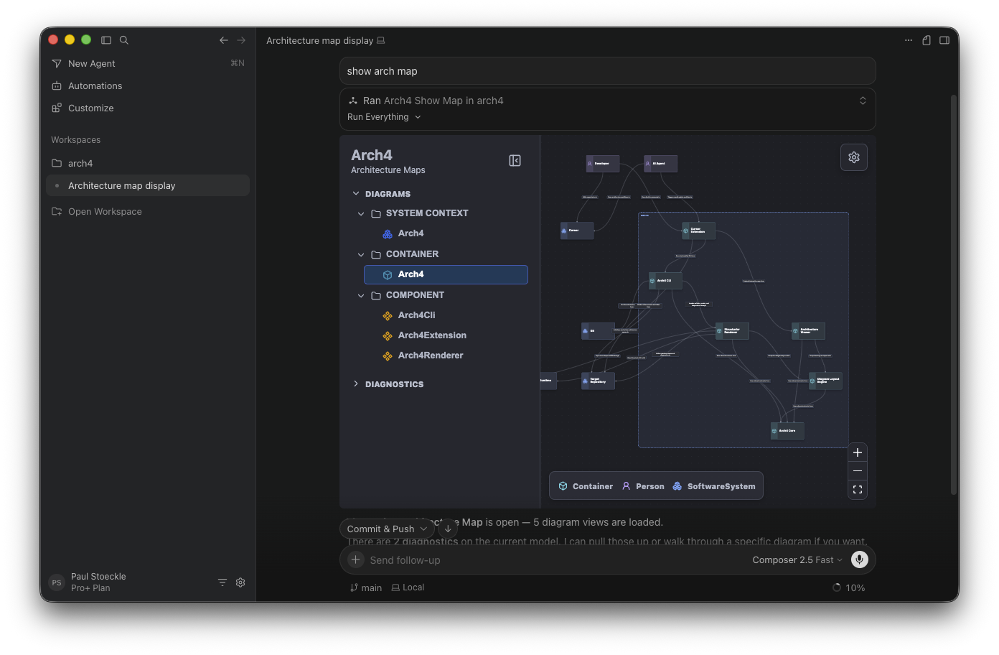

# Cursor MCP Integration

Arch4 ships two Cursor integration paths:

- The Cursor/OpenVSX extension, distributed as a VSIX/OpenVSX package.
- The Cursor plugin bundle under `plugins/cursor/arch4-mcp`, distributed
  separately through Cursor's plugin marketplace when published.

Both paths run the same Arch4 MCP server through Cursor's native plugin
loader, but they are alternative install paths. Do not install the standalone
plugin on top of the VSIX extension in the same Cursor profile. Current Cursor
versions treat each plugin directory as a separate MCP provider, so installing
both creates duplicate Arch4 MCP servers.

The server exposes tools for workspace preparation, architecture source writes,
artifact builds, diagnostics, layout updates, and the interactive architecture
map widget.



## Local Extension Testing

Use the extension path when testing the current VSIX/OpenVSX integration:

```sh
pnpm reinstall:cursor
```

`pnpm reinstall:cursor` runs the full local extension reinstall flow:

1. Builds the repo.
2. Packages the current-platform VSIX.
3. Quits Cursor.
4. Uninstalls the existing Arch4 extension.
5. Installs the new VSIX with `--force`.
6. Verifies the installed webview bundle, bundled MCP server, and MCP widget.
7. Reopens this repo in Cursor.
8. Waits for Cursor activation to write/update the local `arch4-mcp` plugin
   and verifies its `mcp.json`.

This command installs the extension and updates the bundled MCP server because
the MCP server is packaged inside the VSIX at `mcp/index.js`.

When Cursor activates the Arch4 extension, Arch4 writes a small native Cursor
plugin to `~/.cursor/plugins/local/arch4-mcp`. That plugin's `mcp.json` points
at the bundled VSIX MCP server and stores the active workspace path as the
runtime root. Arch4 refreshes that file if Cursor's workspace folders change,
so the detached Agents Window receives the same concrete root as the main
workspace.

The VSIX does not write per-workspace `.cursor/mcp.json` config and does not
require a separate MCP install command. Direct extension MCP registration with
`vscode.cursor.mcp.registerServer()` and extension-scoped plugin registration
with `vscode.cursor.plugins.addPlugin({ path })` are not used because Cursor
3.7.42 exposes those providers in the main workspace but not reliably in the
detached Agents Window.

After Cursor reopens the workspace, test in Cursor Agent:

```text
Use the Arch4 MCP tool arch4_show_map with no arguments and display the returned architecture map widget. Do not edit files.
```

Start a fresh Agent chat after reinstalling or reloading Cursor. Existing Agent
sessions can keep the tool set from before activation and may not see newly
installed MCP tools until a new session is opened.

Expected result:

- Cursor calls `arch4_show_map`.
- The response includes an MCP App resource link for `ui://arch4/map.html`.
- The architecture map renders inline in the Agent thread.
- The widget follows Cursor's current light/dark theme.
- The settings and zoom controls are visible inside the widget frame.
- Collapsing the sidebar refits and focuses the map canvas.

## Local Plugin Testing

Use the plugin path when testing Cursor's plugin bundle shape or marketplace
distribution. This path is for MCP-only Cursor Agent integration without the
VSIX/OpenVSX extension installed.

The committed plugin config uses the published package:

```json
{
  "mcpServers": {
    "arch4": {
      "type": "stdio",
      "command": "npx",
      "args": ["-y", "@arch4/mcp", "--root", "${workspaceFolder}"]
    }
  }
}
```

That means the plugin path requires `@arch4/mcp` to be published to npm. Before
publishing the package, use a local test copy of `mcp.json` that points to the
built local server:

```json
{
  "mcpServers": {
    "arch4": {
      "type": "stdio",
      "command": "node",
      "args": [
        "/absolute/path/to/arch4/packages/mcp/dist/stdio.js",
        "--root",
        "${workspaceFolder}"
      ]
    }
  }
}
```

Then copy the plugin into Cursor's local plugin directory:

```sh
pnpm build
mkdir -p ~/.cursor/plugins/local
rm -rf ~/.cursor/plugins/local/arch4-mcp
cp -R /absolute/path/to/arch4/plugins/cursor/arch4-mcp ~/.cursor/plugins/local/arch4-mcp
```

Reload Cursor in a profile that does not have the Arch4 VSIX installed, then
verify the Arch4 plugin/MCP server appears in Cursor's plugin or MCP settings.

Cursor 3.7.42 rejects local plugin symlinks whose targets are outside
`~/.cursor/plugins/local`, so use a copied local plugin for smoke tests. Do not
commit the local-only `mcp.json` override. The committed plugin config should
continue to use `npx -y @arch4/mcp` for marketplace distribution.

## Publishing

Publishing has three separate steps:

1. Publish the VSIX/OpenVSX extension as usual.
2. Publish `@arch4/mcp` to npm so Cursor plugin installs can run
   `npx -y @arch4/mcp`.
3. Submit the Cursor plugin bundle for Cursor marketplace review.

The Cursor plugin bundle lives in:

```text
plugins/cursor/arch4-mcp/
```

The root marketplace index lives in:

```text
.cursor-plugin/marketplace.json
```

Cursor's plugin marketplace submission is separate from OpenVSX. The repository
must be pushed to a public or reviewable Git remote, and the plugin is submitted
through Cursor's marketplace publishing flow. Marketplace copy should describe
the plugin as an alternative to the VSIX extension, not as an add-on to install
beside it.

## Remaining Release Tasks

Before public release of the MCP/plugin path:

- Publish or stage `@arch4/mcp` on npm.
- Add release notes for the MCP tools and Cursor plugin path.
- Run a clean-machine Cursor plugin smoke test after `@arch4/mcp` is published.
- Submit the Cursor plugin bundle for marketplace review.
