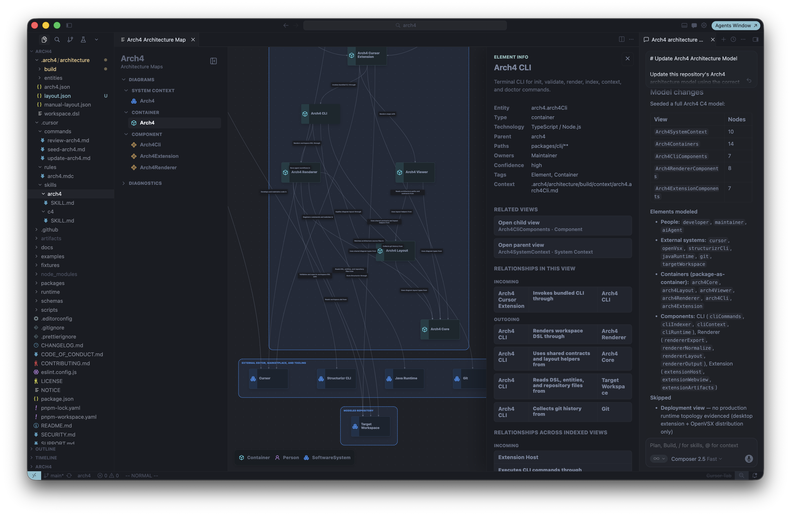
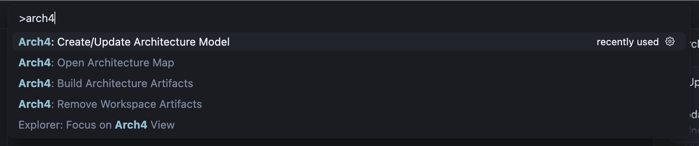

# Arch4

Generated, enriched C4 architecture maps for Cursor repositories.

Arch4 adds a repository-local architecture workspace, interactive C4 maps, and
architecture-aware Cursor workflows so teams and AI agents can understand a
codebase before changing it.


## Architecture Map



## Getting Started

1. Install Arch4 from Cursor's Extensions pane.
2. Run `Arch4: Create/Update Architecture Model`.
3. Run `Arch4: Open Architecture Map`.

Arch4 creates repository-local architecture files, Cursor workflow helpers, and
the local `.arch4/bin/arch4` launcher used by agent workflows. Review generated
model changes before committing them.

## Features

- Initialize `.arch4/architecture/` with a Structurizr DSL workspace when
  creating or updating the model.
- Render interactive architecture maps directly inside Cursor.
- Browse context, container, and component diagrams from an explorer view.
- Inspect selected elements, related views, relationships, notes, and open
  questions.
- Generate repository-aware architecture context for agent workflows.
- Use embedded platform runtimes with no system Java, Structurizr, or Graphviz
  setup for published packages.

## Commands



- `Arch4: Create/Update Architecture Model`
- `Arch4: Build Architecture Artifacts`
- `Arch4: Open Architecture Map`
- `Arch4: Remove Workspace Artifacts`

## Workspace Files

- `.arch4/architecture/workspace.dsl` is the architecture source of truth.
- `.arch4/architecture/entities/*.json` stores entity metadata, ownership,
  repository paths, confidence, notes, and open questions.
- `.arch4/architecture/build/**` is generated output. Teams may commit it when
  they want fresh checkouts to include ready-to-inspect maps.
- `.cursor/commands/*`, `.cursor/rules/arch4.mdc`, and `.cursor/skills/*` are
  installed with Arch4 ownership markers.
- `.arch4/bin/arch4` is generated local tooling for Cursor agents. It discovers
  the installed Arch4 extension runtime and should be treated as disposable
  Arch4-owned state.

Arch4 refuses to overwrite unmarked user-owned Cursor files. It does not create
backup copies before updating or removing Arch4-owned files, so use Git or
local filesystem history for recovery. The `.arch4` directory is Arch4-owned
workspace state and is removed only after explicit confirmation.

## Requirements

Published VSIX packages embed the matching Java and Structurizr CLI runtime for
the target platform. Arch4 owns diagram layout in TypeScript, so rendering does
not require Graphviz or a system `dot` executable.

Supported packaged platforms:

- `darwin-arm64`
- `darwin-x64`
- `linux-x64`
- `win32-x64`

## Troubleshooting

Run:

```sh
.arch4/bin/arch4 doctor
```

Include the Arch4 version, platform, Cursor version, command output, and any
relevant diagnostics from `.arch4/architecture/build/diagnostics.json` when
opening an issue.

## Security and Privacy

Arch4 reads repository files, git history, and architecture metadata from the
workspace where it is installed. Do not enable Arch4 on repositories where this
local inspection is not acceptable.

The architecture map webview uses packaged local assets, restricted local
resource roots, a default-deny content security policy, and no external network
or resource access.

## Support

Use [GitHub Issues](https://github.com/P451M/Arch4/issues) for bugs,
installation problems, and feature requests after the repository is public.
Report security issues privately through GitHub Security Advisories.

## License

Arch4 is licensed under the Apache License 2.0.
